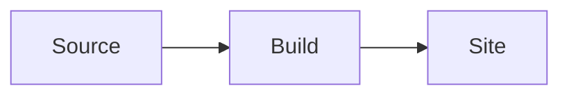

# Zensical Sites

Use this reference for a repository whose authored site contract is
`zensical.toml`. Read [source-evidence.md](source-evidence.md) before importing
new upstream examples or refreshing this catalog.

## Evidence Snapshot

This source map was reviewed on 2026-07-14 against:

- [`zensical/zensical@v0.0.50`](https://github.com/zensical/zensical/tree/428d0d84deb8ce4d7132ba5108ea20eeeb6f5ae4),
  the latest release's executable and bootstrap source.
- [`zensical/docs@4530594f`](https://github.com/zensical/docs/tree/4530594f586ed4f2e756d7efe73369ababa31f61),
  the authored documentation examples.

Use the target repository's installed Zensical version as the runtime
authority. The snapshot explains the feature; the live CLI and rendered site
decide whether it works here.

## Source Map

| Question | Strongest upstream source | What it proves |
| --- | --- | --- |
| Which config and flags does the CLI use? | [`python/zensical/main.py`](https://github.com/zensical/zensical/blob/428d0d84deb8ce4d7132ba5108ea20eeeb6f5ae4/python/zensical/main.py) | Config discovery order and the actual `build`/`serve` flags. |
| What does a generated project enable? | [`python/zensical/bootstrap/zensical.toml`](https://github.com/zensical/zensical/blob/428d0d84deb8ce4d7132ba5108ea20eeeb6f5ae4/python/zensical/bootstrap/zensical.toml) | An executable baseline for theme features and Markdown extensions. |
| How are extension defaults applied? | [`python/zensical/config.py`](https://github.com/zensical/zensical/blob/428d0d84deb8ce4d7132ba5108ea20eeeb6f5ae4/python/zensical/config.py) | Defaults apply only when `markdown_extensions` is absent; an explicit map replaces that default set. |
| How is navigation authored? | [`docs/setup/navigation.md`](https://github.com/zensical/docs/blob/4530594f586ed4f2e756d7efe73369ababa31f61/docs/setup/navigation.md) | TOML shapes for pages, titled entries, sections, and external links. |
| Which page metadata is supported? | [`docs/authoring/frontmatter.md`](https://github.com/zensical/docs/blob/4530594f586ed4f2e756d7efe73369ababa31f61/docs/authoring/frontmatter.md) | Title, description, icon, status, template, and sidebar metadata. |
| Which visual recipes are documented? | [`docs/authoring/`](https://github.com/zensical/docs/tree/4530594f586ed4f2e756d7efe73369ababa31f61/docs/authoring) | Feature syntax and documented prerequisites. |
| What does validation check? | [`docs/setup/validation.md`](https://github.com/zensical/docs/blob/4530594f586ed4f2e756d7efe73369ababa31f61/docs/setup/validation.md) | Link checks, strict-build behavior, and deprecated checks. |

The documentation repository itself currently uses `mkdocs.yml`. Treat its
Zensical snippets as authored examples, not as end-to-end proof of a
`zensical.toml` build. Reconcile them with the executable bootstrap and the
target site's generated HTML.

## Configuration Traps

- Per-feature documentation blocks are fragments. Merge them into the existing
  config; do not replace a complete extension map with one fragment.
- Once `project.markdown_extensions` is explicitly present, Zensical no longer
  supplies its full default extension set. Preserve every extension the site
  relies on. `toc` and `tables` are still injected by the current parser, but do
  not depend on that implementation detail as a substitute for an intentional
  config.
- Merge a new theme feature into the existing `project.theme.features` array.
  Replacing the array can silently disable navigation, tabs, copy buttons, and
  other site behavior.
- The [code-annotations guide](https://github.com/zensical/docs/blob/4530594f586ed4f2e756d7efe73369ababa31f61/docs/authoring/code-blocks.md)
  at this snapshot contains a singular `feature` key, while the executable
  bootstrap uses `features`. Use `features` and prove the annotation render.
- Material for MkDocs syntax is a candidate, not a promise. Zensical
  compatibility is evolving; require Zensical source evidence and a local
  render before adopting it.

## Proof-Carrying Recipes

The TOML blocks below are fragments. Merge them with the site's existing
tables and arrays.

### Reader navigation

Use explicit navigation when the reader journey should differ from the docs
directory layout.

```toml
[project]
nav = [
  { "Home" = "index.md" },
  { "Guides" = ["guides/index.md", "guides/deploy.md"] }
]
```

Prerequisite: every path is relative to `docs_dir`. Add the page and nav entry
in the same change. Verify that the build reports no missing page and that the
generated navigation contains both labels and resolved links.

### Page metadata

Use front matter for page-specific discovery or rendering behavior, not as an
unstructured data store.

```yaml
---
title: Deploy the service
description: Build, verify, and publish a production deployment.
icon: lucide/rocket
---
```

Prerequisite: the icon must exist in a bundled icon set. Verify the document
title, description `<meta>` element, and navigation label in the generated
page. A custom `template` additionally requires a configured overrides
directory and a real template file.

### Admonitions and details

Use an admonition for a side constraint that should not break the main task
flow; use a collapsible detail only for optional depth.

```toml
[project.markdown_extensions.admonition]
[project.markdown_extensions.pymdownx.details]
[project.markdown_extensions.pymdownx.superfences]
```

```markdown
!!! warning "Generated file"

    Edit the generator input, then rebuild this page.
```

Verify the target page contains an admonition container such as
`<div class="admonition warning">`. If the source marker renders literally, the
extension map is incomplete or unsupported.

### Content tabs

Use tabs for true alternatives that share one reader decision, such as platform
or language variants. Do not hide sequential steps behind tabs.

```toml
[project.markdown_extensions.pymdownx.superfences]
[project.markdown_extensions.pymdownx.tabbed]
alternate_style = true
```

```markdown
=== "macOS"

    `brew install example`

=== "Linux"

    `curl -fsSL https://example.invalid/install | sh`
```

Add `content.tabs.link` to `project.theme.features` only when matching labels
should switch together across the site. Verify a `tabbed-set` container and the
expected labels in the generated page.

### Entry-point cards

Use a grid of cards to route readers among peer destinations. Cards are poor
containers for a long procedure.

```toml
[project.markdown_extensions.attr_list]
[project.markdown_extensions.md_in_html]
```

```html
<div class="grid cards" markdown>

- __Install__ — prepare a workstation
- __Deploy__ — publish a verified build

</div>
```

Verify the generated page retains a `grid cards` container and that every card
has a useful destination when it is acting as navigation. Icons require their
own emoji/icon extension configuration.

### Mermaid diagrams

Use Mermaid when relationships or state changes are harder to understand in
prose. Keep the diagram tied to a real system fact.

```toml
[project.markdown_extensions.pymdownx.superfences]
custom_fences = [
  { name = "mermaid", class = "mermaid", format = "pymdownx.superfences.fence_code_format" }
]
```

````markdown

````

Verify a `<pre class="mermaid">` block in the generated page. When the site
uses instant navigation or custom JavaScript, preview the navigation path as
well as the first page load.

### Code annotations

Treat annotations as version-sensitive. They require Pygments-backed syntax
highlighting, `pymdownx.highlight`, `pymdownx.superfences`, and the theme flag:

```toml
[project.theme]
features = ["content.code.annotate"]
```

````markdown
```toml
[project]
site_name = "Example" # (1)!
```

1. This value appears in the header and page title.
````

Build and inspect the specific example in a browser after page scripts run. In
v0.0.50, static HTML retains the highlighted `# (1)!` comment and the client
runtime turns it into an annotation link, so static token absence is the wrong
proof. Confirm an annotation control or tooltip is reachable in the runtime DOM.
If it is absent, remove the annotation syntax or use adjacent prose; a green
build alone is insufficient.

## Validation Ladder

Inspect the live binary before selecting flags:

```bash
zensical --version
zensical build --help
```

Then use the strongest supported build:

```bash
zensical build --clean
zensical build --clean --strict  # only when help does not mark strict unsupported
```

Zensical v0.0.50 supports strict mode for `build` but still marks strict mode
unsupported for `serve`. Older installed versions may mark strict builds
unsupported too. Prefer the repository wrapper when it pins the tool or adds
link, navigation, generated-doc, or content-contract checks.

After the build, inspect only the changed pages under the configured `site_dir`:

```bash
rg -n 'admonition|tabbed-set|grid cards|class="mermaid"' <site_dir>/<page>.html
```

The proof is feature-specific: successful exit proves the site built; the
static rendered signal proves a server-rendered feature ran; a browser snapshot
proves client-transformed behavior such as code annotations.
